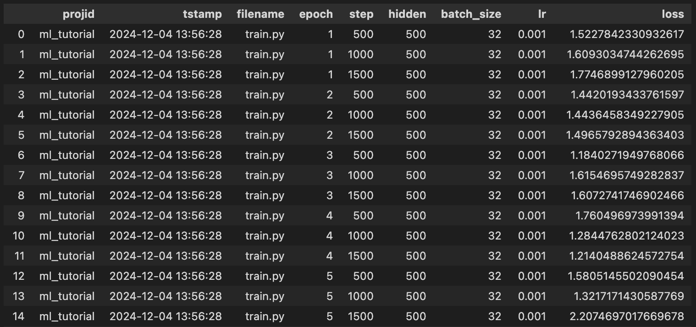

FlorDB
================================
[](https://pypi.org/project/flordb/)


FlorDB is a hindsight logging database for the AI/ML lifecycle. It works in tandem with any workflow management solution for Python, such as `Make`, `Airflow`, `MLFlow`, `Docker`, `Slurm`, and `Jupyter`, to manage model developers' logs, execution data, versions of code (via `git`), and `torch` checkpoints. In addition to serving as a nimble experiment management solution for ML Engineers, FlorDB subsumes functionality from bespoke ML systems, operating as a **model registry**, **feature store**, **labeling solution**, and others, as needed.

FlorDB contains a record-replay sub-system to enable hindsight logging: a post-hoc analysis practice that involves adding logging statements *after* encountering a surprise, and efficiently re-training with more logging as needed. When model weights are updated during training, Flor takes low-overhead checkpoints, and uses those checkpoints for replay speedups based on memoization, program slicing, and parallelism. As we will soon discuss, most FlorDB use-cases (e.g. data prep, featurization) do not involve `torch` checkpointing and can use the Flor data model independently of the record-replay sub-system.

FlorDB is software developed at UC Berkeley's [RISE](https://rise.cs.berkeley.edu/) Lab (2017 - 2024). It is actively maintained by [Rolando Garcia](https://rlnsanz.github.io) (rolando.garcia@asu.edu) at ASU's School of Computing & Augmented Intelligence (SCAI).

## Installation
To install the latest stable version of FlorDB, run:

```bash
pip install flordb
```

### Development Installation

For developers who want to contribute, are co-authors on a FlorDB manuscript and plan to run experiments, or need the latest features, install directly from the source:

```bash
git clone https://github.com/ucbrise/flor.git
cd flor
pip install -e .
```

To keep your local copy up-to-date with the latest changes, remember to regularly pull updates from the repository (from within the `flor` directory):

```bash
git pull origin
```

## Just start logging

FlorDB is designed to be easy to use. 
You don't need to define a schema, or set up a database.
Just start logging your runs with a single line of code:

```python
import flor

flor.log("msg", "Hello world!")
```
```
msg: Hello, World!

Changes committed successfully
```

You can read your logs with a Flor Dataframe:

```python
import flor

flor.dataframe("msg")
```


## Logging your experiments
FlorDB has a low floor, but a high ceiling. 
You can start logging with a single line of code, but you can also log complex experiments with many hyper-parameters and metrics.

Here's how you can modify your existing PyTorch training script to incorporate FlorDB logging:


```python
import flor
import torch

# Define and log hyper-parameters
hidden_size = flor.arg("hidden", default=500)
batch_size = flor.arg("batch_size", 32)
learning_rate = flor.arg("lr", 1e-3)
...

# Initialize your data loaders, model, optimizer, and loss function
trainloader: torch.utils.data.DataLoader
testloader:  torch.utils.data.DataLoader
optimizer:   torch.optim.Optimizer
net:         torch.nn.Module
criterion:   torch.nn._Loss

# Use FlorDB's checkpointing to manage model states
with flor.checkpointing(model=net, optimizer=optimizer):
    for epoch in flor.loop("epoch", range(num_epochs)):
        for data in flor.loop("step", trainloader):
            inputs, labels = data
            optimizer.zero_grad()
            outputs = net(inputs)
            loss = criterion(outputs, labels)
            loss.backward()
            optimizer.step()

            # Log the loss value for each step
            flor.log("loss", loss.item())

        # Evaluate the model on the test set
        eval(net, testloader)
```

To view the hyper-parameters and metrics logged during training, you can use the `flor.dataframe` function:

```python
import flor
flor.dataframe("hidden", "batch_size", "lr", "loss")
```


### Logging hyper-parameters
As shown above, you can log hyper-parameters with `flor.arg`:

```python
# Define and log hyper-parameters

hidden_size = flor.arg("hidden", default=500)
batch_size = flor.arg("batch_size", 32)
learning_rate = flor.arg("lr", 1e-3)
...
seed = flor.arg("seed", default=randint(1, 10000))

# Set the random seed for reproducibility
torch.manual_seed(seed)
```

When the experiment is run, the hyper-parameters are logged, and their values are stored in FlorDB.

During replay, `flor.arg` reads the values from the database, so you can easily reproduce the experiment.

### Setting hyper-parameters from the command line
You can set the value of any `flor.arg` from the command line:
```bash 
$ python train.py --kwargs hidden=250 lr=5e-4
```


## Hindsight Logging for when you miss something
Hindsight logging is a post-hoc analysis practice that involves adding logging statements *after* encountering a surprise, and efficiently re-training with more logging as needed. FlorDB supports hindsight logging across multiple versions with its record-replay sub-system.

## Publications

To cite this work, please refer to the [Multiversion Hindsight Logging](https://arxiv.org/abs/2310.07898) paper (pre-print '23).

FlorDB is open source software developed at UC Berkeley. 
[Joe Hellerstein](https://dsf.berkeley.edu/jmh/) (databases), [Joey Gonzalez](http://people.eecs.berkeley.edu/~jegonzal/) (machine learning), and [Koushik Sen](https://people.eecs.berkeley.edu/~ksen) (programming languages) 
are the primary faculty members leading this work.

This work is released as part of [Rolando Garcia](https://rlnsanz.github.io/)'s [doctoral dissertation](https://www2.eecs.berkeley.edu/Pubs/TechRpts/2024/EECS-2024-142.html) at UC Berkeley,
and has been the subject of study by Eric Liu and Anusha Dandamudi, 
both of whom completed their master's theses on FLOR.
Our list of publications are reproduced below.
Finally, we thank [Vikram Sreekanti](https://www.vikrams.io/), [Dan Crankshaw](https://dancrankshaw.com/), and [Neeraja Yadwadkar](https://cs.stanford.edu/~neeraja/) for guidance, comments, and advice.
[Bobby Yan](https://bobbyy.org/) was instrumental in the development of FLOR and its corresponding experimental evaluation.

* [The Management of Context in the Machine Learning Lifecycle](https://www2.eecs.berkeley.edu/Pubs/TechRpts/2024/EECS-2024-142.html). _R Garcia_. EECS Department, University of California, Berkeley, 2024. UCB/EECS-2024-142.
* [Multiversion Hindsight Logging for Continuous Training](https://arxiv.org/abs/2310.07898). _R Garcia, A Dandamudi, G Matute, L Wan, JE Gonzalez, JM Hellerstein, K Sen_. pre-print on ArXiv, 2023.
* [Hindsight Logging for Model Training](http://www.vldb.org/pvldb/vol14/p682-garcia.pdf). _R Garcia, E Liu, V Sreekanti, B Yan, A Dandamudi, JE Gonzalez, JM Hellerstein, K Sen_. The VLDB Journal, 2021.
* [Fast Low-Overhead Logging Extending Time](https://www2.eecs.berkeley.edu/Pubs/TechRpts/2021/EECS-2021-117.html). _A Dandamudi_. EECS Department, UC Berkeley Technical Report, 2021.
* [Low Overhead Materialization with FLOR](https://www2.eecs.berkeley.edu/Pubs/TechRpts/2020/EECS-2020-79.html). _E Liu_. EECS Department, UC Berkeley Technical Report, 2020. 
* [Context: The Missing Piece in the Machine Learning Lifecycle](https://rlnsanz.github.io/dat/Flor_CMI_18_CameraReady.pdf). _R Garcia, V Sreekanti, N Yadwadkar, D Crankshaw, JE Gonzalez, JM Hellerstein. CMI, 2018.


## License
FlorDB is licensed under the [Apache v2 License](https://www.apache.org/licenses/LICENSE-2.0).
